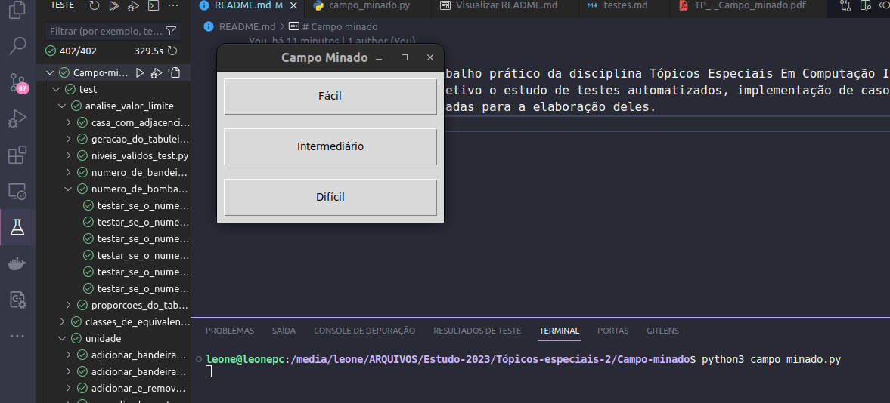
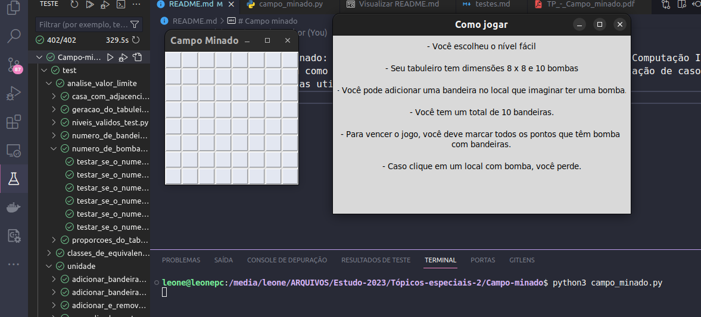
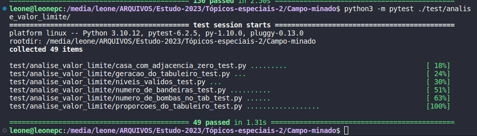
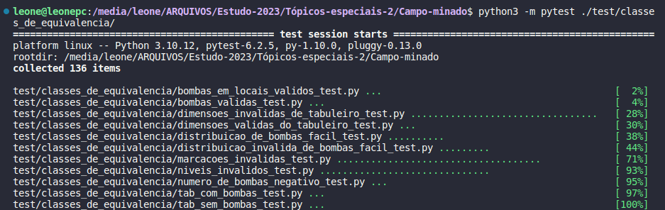
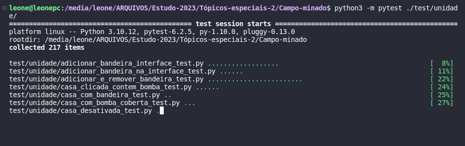
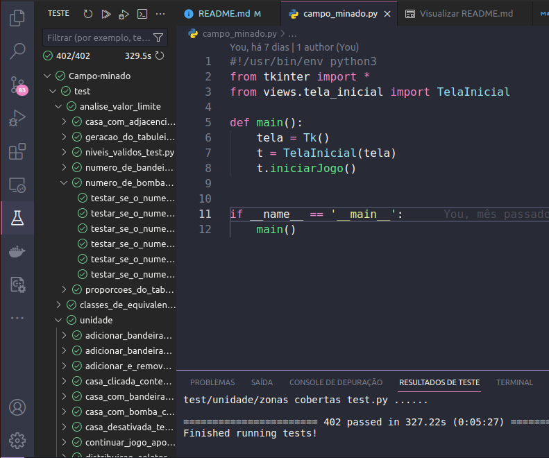

# Campo minado
- Jogo de Campo Minado: trabalho prático da disciplina Tópicos Especiais Em Computação II.
- Este projeto tem como objetivo o estudo de testes automatizados, implementação de casos de testes e técnicas utilizadas para a elaboração deles.

<Br>

## Dependências
- Python 3.10.12
- pytest

## Para executar o jogo

### Entre na raiz do projeto
```sh
cd Campo-minado/
```

### Execute o jogo

```sh
python3 campo_minado.py
```

<Br>



<Br>



<Br>

## Para executar os testes

### Entre na raiz do projeto
```sh
cd Campo-minado/
```

### Execute o comando para executar os testes de análise de valor limite

```sh
python3 -m pytest ./test/analise_valor_limite/
```

<Br>



<Br>

### Execute o comando para executar os testes de classes de equivalência 

```sh
python3 -m pytest ./test/classes_de_equivalencia/
```

<Br>



<Br>

### Execute o comando para executar os testes unidade

```sh
python3 -m pytest ./test/unidade/
```

<Br>



<Br>

### Pelo VS Code
- Também é possível executar os testes pelo laboratório de testes do VS Code.
- Para isso,deve-se configurar a execução como a raiz do projeto.

<Br>



<Br>

